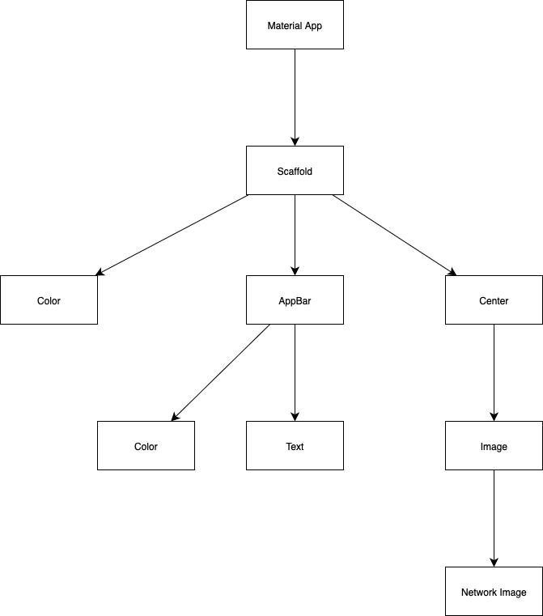
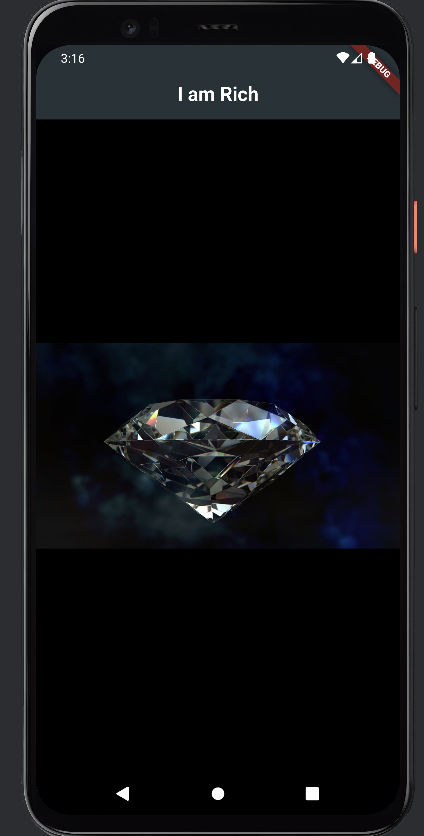

# 💎 I Am Rich - Flutter App

Back in the early days of the App Store, there was a legendary app called **"I Am Rich"** that was sold for $999.  
The only thing it did was show a shiny red gem — and 8 people actually bought it!

As a fun exercise while learning Flutter through Angela Yu’s course, I recreated this iconic app using **Flutter**.  
This project helped me understand the fundamentals of Flutter layout, widgets, and app structure.

---

## 🚀 Features

- Custom `AppBar` with centered title
- Dark background with a centered diamond image
- Simple and clean UI built with Flutter
- Practiced `Scaffold`, `AppBar`, `Center`, and `Image` widgets

---

## 🧱 Widget Tree



---

## 📸 Screenshot

Here’s how the final app looks:



---

## 🛠️ How to Run This Project

1. Clone this repository:
   ```bash
   git clone https://github.com/SinemAkkaya/i_am_rich.git
   ```
2. Navigate to the project folder:
   ```bash
   cd i_am_rich
   ```
3. Get the dependencies:
   ```bash
   flutter pub get
   ```
4. Run the app:
   ```bash
   flutter run
   ```

---

## 👩🏻‍💻 About Me

This was one of my first mobile app exercises using Flutter.  
I’m a senior software engineering student passionate about UI, mobile development, and building fun, educational projects!

---

✨ Made with Flutter & curiosity  
💻 By [Sinem Akkaya](https://github.com/SinemAkkaya)
